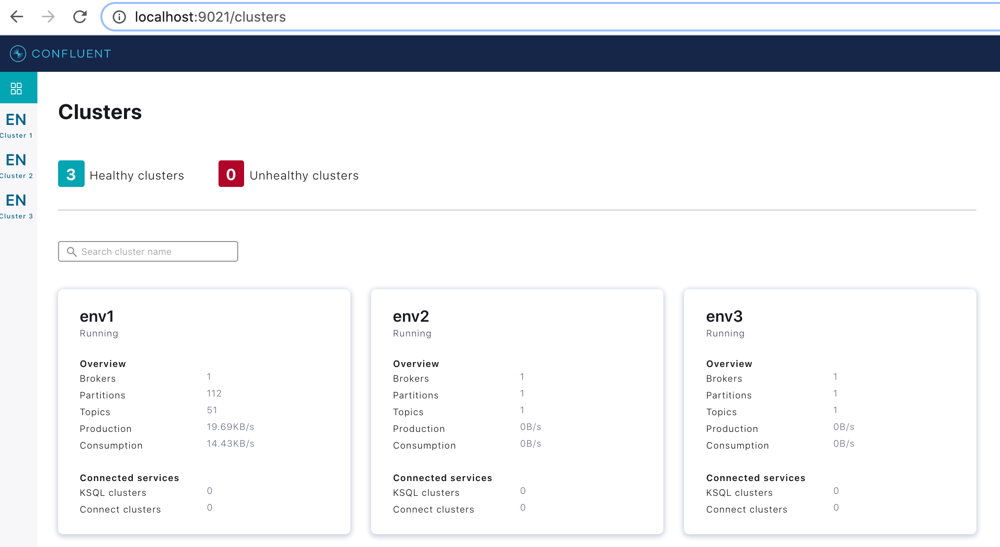

# simple_multicluster_c3
The world's simplest 3 env setup with Confluent Control Center (C3) connected to ENV1 and 2 other ENVs reporting to it.

````
export CONFLUENT_PlATFORM_VERSION=6.0.0
docker-compose up -d
````

And you should see

````
docker-compose ps             
     Name                 Command            State              Ports            
---------------------------------------------------------------------------------
control-center   /etc/confluent/docker/run   Up      0.0.0.0:9021->9021/tcp      
kafka_env1       /etc/confluent/docker/run   Up      0.0.0.0:9092->9092/tcp      
kafka_env2       /etc/confluent/docker/run   Up      0.0.0.0:9093->9092/tcp      
kafka_env3       /etc/confluent/docker/run   Up      0.0.0.0:9094->9092/tcp      
zookeeper        /etc/confluent/docker/run   Up      2181/tcp, 2888/tcp, 3888/tcp
````


There's 2 things that need to happen for a cluster to show up in C3.

1. the cluster must be added to C3's property file via a link to its bootstrap URL
`CONTROL_CENTER_KAFKA_<name>_BOOTSTRAP_SERVERS: host:port`
or
`control.center.kafka.<name>.bootstrap_servers=host:port`
The <name> is completely arbitrary, but is what shows up in the UI

2. the environment's brokers must be configured so that their metrics reporters write to the cluster that C3 is connected to.
i.e. whatever cluster is used in `CONTROL_CENTER_BOOTSTRAP_SERVERS` should be used as the destination for `CONFLUENT_METRICS_REPORTER_BOOTSTRAP_SERVERS` in the remote envs.

